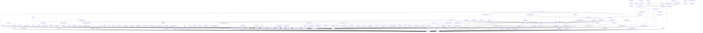

# Shell Functions Dependency Graph

This is the dependency graph for the functions in [`./lib/`](./lib/).

```mermaid
graph TD;
    download --> which_bin;
    download --> exit_fun;
    download --> get_nthreads;
    download --> require;
    bat_fun --> which_bin;
    dfh --> which_bin;
    dfh --> bat_fun;
    require --> which_bin;
    require --> exit_fun;
    cat_color --> require;
    cat_color --> which_bin;
    cat_color --> bat_fun;
    cd_fun --> which_bin;
    exa_fun --> require;
    exa_fun --> which_bin;
    conda_priv_fun --> get_conda_bin;
    create_log --> require;
    create_log --> __get_tz_timestamp;
    create_log --> __get_hash;
    create_temp --> which_bin;
    unpack --> __unpack_deb;
    unpack --> which_bin;
    unpack --> is_compressed;
    unpack --> exit_fun;
    install_apps --> get_config;
    install_apps --> require;
    install_apps --> __install_app;
    bootstrap_user --> require;
    bootstrap_user --> __check_req_cli_tools;
    bootstrap_user --> __build_git;
    bootstrap_user --> __install_yq;
    bootstrap_user --> __build_bash;
    bootstrap_user --> __install_python_cli_tools;
    bootstrap_user --> __build_rust_cargo;
    bootstrap_user --> __clean_home;
    bootstrap_user --> install_apps;
    bootstrap_user --> __rebuild_rust_source_tools;
    bootstrap_user --> __install_node_cli_tools;
    bootstrap_user --> clean_pixi_and_conda_cache;
    exec_remote --> require;
    follow_logs --> which_bin;
    follow_logs --> bat_fun;
    get_nthreads --> which_bin;
    get_nthreads --> require;
    parse_yaml --> which_bin;
    parse_yaml --> exit_fun;
    parse_yaml --> __parse_yaml_yq;
    parse_yaml --> __parse_yaml_ruby;
    parse_yaml --> __parse_yaml_python;
    reload_interface --> __reload_skhd;
    reload_interface --> __reload_sketchybar;
    reload_interface --> __reload_yabai;
    rm_safe --> which_bin;
    rm_safe --> exit_fun;
    ssh_forget --> which_bin;
    ssh_forget --> require;
    ssh_forget --> exit_fun;
    ssh_alias --> get_config;
    ssh_alias --> ssh_fun;
    ssh_alias --> __sync_user_config;
    ssh_fun --> require;
    ssh_generate_key --> require;
    ssh_key_create_and_push --> require;
    ssh_key_create_and_push --> ssh_generate_key;
    ssh_key_create_and_push --> ssha_fun;
    ssh_key_create_and_push --> ssh_send_key;
    ssha_fun --> require;
    ssha_fun --> get_os_type;
    sudo_check --> which_bin;
    sudo_check --> exit_fun;
    sudo_fun --> which_bin;
    sudo_fun --> exit_fun;
    type_color --> which_bin;
    type_color --> bat_fun;
    yc --> require;
    get_os_arch --> which_bin;
    get_os_arch --> exit_fun;
    get_os_type --> which_bin;
    get_os_type --> exit_fun;
    get_hostname --> which_bin;
    get_hostname --> exit_fun;
    scan_port --> require;
    scan_ssh_ports --> require;
    slurm_check_gpus --> require;
    slurm_check_job --> require;
    slurm_check_limits --> require;
    slurm_check_nodes --> require;
    slurm_check_partitions --> require;
    slurm_check_queue --> require;
    slurm_interactive_gpu_session --> slurm_interactive_session;
    slurm_interactive_session --> require;
    clear_pure --> which_bin;
    sleep_pure --> exit_fun;
    bashly_install --> which_bin;
    bashly_update --> bashly_install;
    bashly_build --> which_bin;
    bashly_build --> exit_fun;
    clean_homebrew_cache --> which_bin;
    __check_req_cli_tools --> require;
    __clean_home --> which_bin;
    __build_rust_cargo --> which_bin;
    __build_rust_cargo --> require;
    __rebuild_rust_source_app --> exit_fun;
    __rebuild_rust_source_app --> require;
    __rebuild_rust_source_tools --> which_bin;
    __rebuild_rust_source_tools --> require;
    __check_glibc --> which_bin;
    __check_glibc --> exit_fun;
    __build_glibc --> __check_glibc;
    __build_glibc --> which_bin;
    __build_glibc --> require;
    __build_glibc --> get_nthreads;
    __build_glibc --> create_temp;
    __build_glibc --> download;
    __build_glibc --> unpack;
    __build_git --> which_bin;
    __build_git --> require;
    __build_git --> get_nthreads;
    __build_git --> create_temp;
    __build_git --> download;
    __build_git --> unpack;
    __build_bash --> which_bin;
    __build_bash --> require;
    __build_bash --> get_nthreads;
    __build_bash --> create_temp;
    __build_bash --> download;
    __build_bash --> unpack;
    __install_yq --> __install_path;
    __install_yq --> require;
    __install_yq --> exit_fun;
    __install_yq --> __get_gh_latest_release;
    __install_yq --> download;
    __install_node_cli_tools --> which_bin;
    __install_node_cli_tools --> get_config;
    __install_python_cli_tools --> __install_app;
    __install_python_cli_tools --> which_bin;
    __install_python_cli_tools --> get_config;
    cd_prj --> __cd_dir;
    cd_cfg --> __cd_dir;
    __cd_dir --> which_bin;
    check_gum --> require;
    check_in_file --> require;
    check_used_ports --> require;
    remove_line --> type_str;
    command_path --> remove_line;
    conda_list_envs --> conda_priv_fun;
    conda_env_exists --> require;
    conda_env_exists --> exit_fun;
    conda_env_exists --> conda_list_envs;
    conda_run --> exit_fun;
    conda_run --> conda_env_exists;
    conda_run --> conda_priv_fun;
    conda_create_env --> conda_env_exists;
    conda_create_env --> exit_fun;
    conda_create_env --> get_conda_platform;
    conda_create_env --> conda_priv_fun;
    __get_tz_timestamp --> require;
    __get_hash --> exit_fun;
    __get_hash --> require;
    __get_hash --> __get_hash_fallback;
    disk_usage --> dfh;
    disk_usage --> which_bin;
    disk_usage --> get_os_type;
    docker_get_available_memory --> require;
    encrypt_file_password --> which_bin;
    encrypt_file_password --> exit_fun;
    unencrypt_file_password --> which_bin;
    unencrypt_file_password --> exit_fun;
    encrypt_file_key --> which_bin;
    encrypt_file_key --> exit_fun;
    encrypt_file_key --> get_config;
    unencrypt_file_key --> which_bin;
    unencrypt_file_key --> exit_fun;
    unencrypt_file_key --> get_config;
    fix_quotes --> which_bin;
    gcloud_fun --> conda_create_env;
    gcloud_fun --> conda_run;
    gsutil_fun --> conda_create_env;
    gsutil_fun --> conda_run;
    gen_passwd --> which_bin;
    gen_passwd --> require;
    gen_passwd --> exit_fun;
    get_conda_bin --> which_bin;
    get_conda_bin --> install_micromamba;
    get_conda_bin --> exit_fun;
    install_micromamba --> which_bin;
    install_micromamba --> get_conda_platform;
    install_micromamba --> download;
    install_micromamba --> dirname_pure;
    get_conda_platform --> get_os_type;
    get_conda_platform --> get_os_arch;
    get_conda_platform --> exit_fun;
    __conda_platform_arm64_to_64 --> get_conda_platform;
    get_config --> get_config_path;
    get_config --> exit_fun;
    get_config --> parse_yaml;
    get_config_path --> get_config;
    get_default_shell --> exit_fun;
    get_default_shell --> which_bin;
    get_default_shell --> get_os_type;
    git_remove_file --> exit_fun;
    git_remove_file --> require;
    icat --> which_bin;
    icat --> require;
    __get_gh_latest_release --> require;
    __get_gh_latest_tag --> require;
    __get_gh_latest_tag --> which_bin;
    __get_app_num_from_app_name --> require;
    __get_app_num_from_app_name --> get_config;
    __install_app_source --> which_bin;
    __install_app_source --> require;
    __install_app_source --> get_nthreads;
    __install_app_source --> create_temp;
    __install_app_source --> download;
    __install_app_source --> unpack;
    __install_app_source --> __build_app;
    __install_app_mamba --> which_bin;
    __install_app_mamba --> exit_fun;
    __install_app_conda --> __install_app_mamba;
    __install_app_binary --> which_bin;
    __install_app_binary --> create_temp;
    __install_app_binary --> download;
    __install_app_binary --> unpack;
    __install_app_cargo --> which_bin;
    __install_app_cargo --> exit_fun;
    __install_app --> which_bin;
    __install_app --> require;
    __install_app --> __get_app_num_from_app_name;
    __install_app --> exit_fun;
    __install_app --> get_config;
    __install_app --> __get_gh_latest_release;
    __install_app --> __get_gh_latest_tag;
    __install_app --> __install_path;
    __install_app --> __install_app_source;
    __install_app --> __install_app_binary;
    __install_app --> __install_app_cargo;
    __install_app --> __install_app_mamba;
    is_available --> which_bin;
    is_compressed --> which_bin;
    just_source --> require;
    just_source --> exit_fun;
    neovim_install --> get_os_type;
    neovim_install --> conda_create_env;
    neovim_install --> conda_run;
    neovim_install --> neovim_run;
    neovim_clean --> rm_safe;
    neovim_clean --> conda_env_exists;
    neovim_clean --> conda_priv_fun;
    neovim_run --> conda_run;
    neovim_edit --> neovim_run;
    __parse_yaml_ruby --> which_bin;
    __parse_yaml_yq --> which_bin;
    __parse_yaml_python --> which_bin;
    __parse_yaml_python --> exit_fun;
    clean_pixi_and_conda_cache --> which_bin;
    pixi_install_pixi_bin --> which_bin;
    pixi_install_pixi_bin --> pixi_update_pixi_bin;
    pixi_update_pixi_bin --> which_bin;
    pixi_sync_global_tools --> which_bin;
    pixi_update_global_tools --> which_bin;
    print_table --> which_bin;
    __print_truecolor_scale --> require;
    print_term_capabilities --> __print_terminal_info;
    print_term_capabilities --> __print_truecolor_scale;
    print_term_capabilities --> __print_escape_chars;
    pure_cat --> cat_pure;
    pure_head --> head_pure;
    __reload_yabai --> require;
    __reload_yabai_code_signature --> require;
    __reload_yabai_code_signature --> which_bin;
    __reload_skhd_code_signature --> require;
    __reload_skhd_code_signature --> which_bin;
    replace_in_file --> require;
    require_fun --> exit_fun;
    rstats_start_rmote --> which_bin;
    rstats_boostrap_quarto_install --> which_bin;
    rstats_boostrap_quarto_install --> exit_fun;
    rstats_install_all_pkgs --> require;
    rstats_install_all_pkgs --> get_config;
    rstats_install_all_pkgs --> get_conda_bin;
    rstats_install_pkg --> exit_fun;
    rstats_install_pkg --> require;
    rstats_install_pkg --> get_nthreads;
    rstats_install_rstats_version --> require;
    rstats_install_rstats_version --> exit_fun;
    rstats_install_rstats_version --> get_os_type;
    rstats_update_rstats_version --> rstats_install_rig;
    rstats_update_rstats_version --> rstats_install_rstats_version;
    rstats_install_rig --> which_bin;
    rstats_install_rig --> __install_app;
    rstats_remove_pkg --> require;
    rstats_rstudio --> require;
    rstats_rstudio --> exit_fun;
    rstats_check_pkg --> require;
    rstats_build_pkg --> require;
    rstats_create_conda_env --> conda_create_env;
    rstats_install_pkg_conda --> conda_run;
    rstats_install_r-env_pixi --> require;
    __prepare_kitty_shell_integration --> require;
    __prepare_kitty_shell_integration --> which_bin;
    kitty_ssh_fun --> require;
    __source_remote_shell-lib --> source_remote;
    __sync_user_config --> exit_fun;
    __sync_user_config --> require;
    __sync_user_config --> get_config;
    ssh_send_key --> require;
    __update_configs --> which_bin;
    text_box --> require;
    timeout_exec --> require;
    __unpack_deb --> which_bin;
    __unpack_deb --> unpack;
    __user_create --> exit_fun;
    __user_create --> which_bin;
    __user_create --> get_hostname;
    __user_create --> gen_passwd;
    __user_add_group --> require;
    __user_remove --> require;
    __user_remove --> exit_fun;
    __user_replicate_pw_server --> require;
    __user_replicate_pw_server --> exec_remote;
    __create_data_storage_user --> require;
    __create_data_storage_user --> sudo_check;
    __create_data_storage_user --> exit_fun;
    __create_data_storage_all --> __create_data_storage_user;
    watch_fun --> require;
    watch_fun --> clear_pure;
    watch_fun --> sleep_pure;
```
